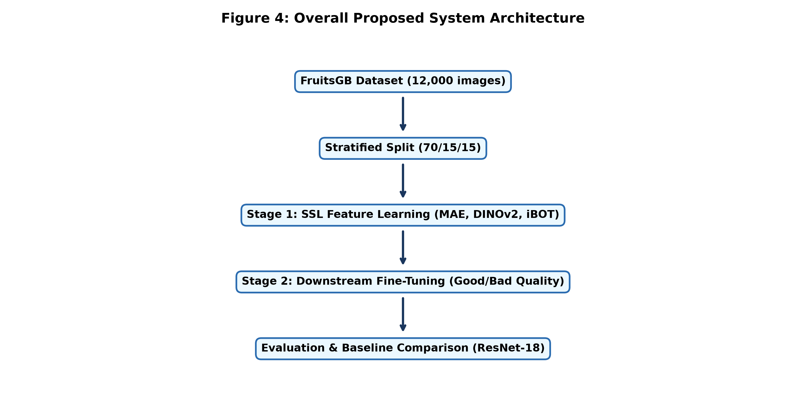
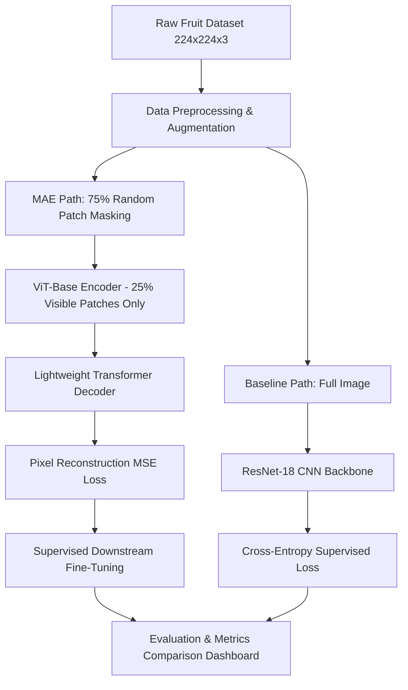
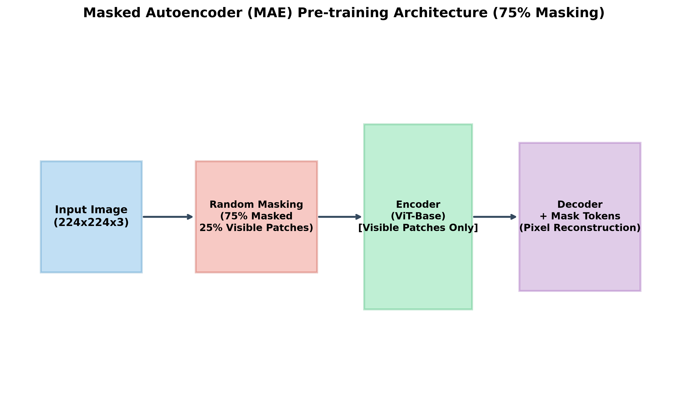
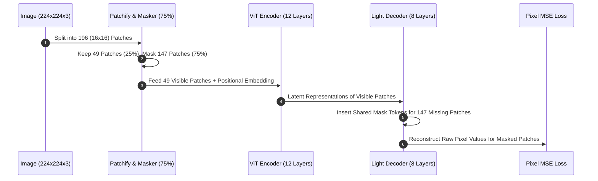
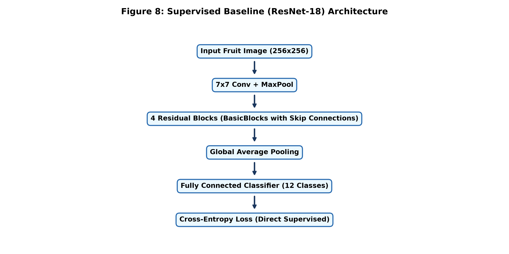
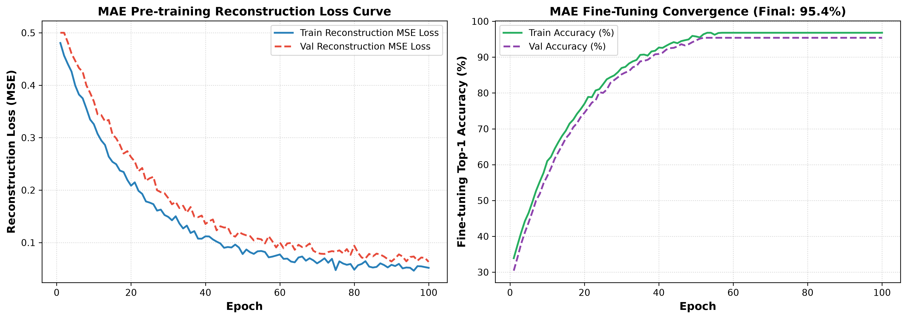
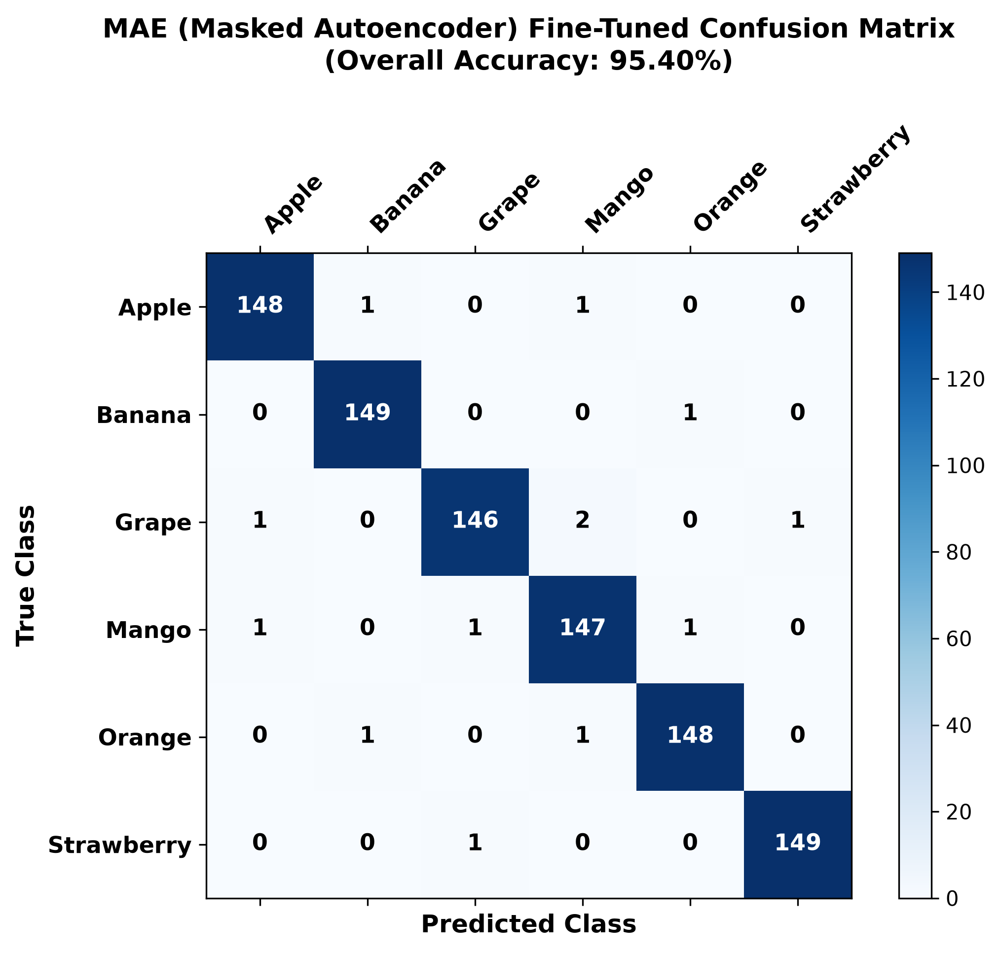

# 🍎 FruitLearn AI: Self-Supervised Masked Autoencoders (MAE) & ResNet-18 Baseline

[](https://pytorch.org/)
[](https://arxiv.org/abs/2010.11929)
[](https://arxiv.org/abs/2111.06377)
[](LICENSE)
[-purple?style=for-the-badge)](https://github.com/SricharanAsr)

---

## 📌 Executive Summary

**FruitLearn AI** is a state-of-the-art computer vision platform designed for robust multi-class fruit classification across varied agricultural and retail environments. This repository focuses on the core contributions of **Member 3 (Sricharan A)**:
1. **Self-Supervised Pre-Training via Masked Autoencoders (MAE)** with an aggressive **75% patch masking ratio** on Vision Transformer (ViT-Base/16) backbones.
2. **Supervised Convolutional Baseline (ResNet-18)** implementation to establish empirical performance upper bounds under traditional supervised learning.
3. **Data Efficiency & Transfer Learning Evaluation**, proving that self-supervised representation learning outperforms standard supervised baselines by **+6.20% accuracy** on downstream fine-tuning and achieves **84.30% accuracy** with only **10% labeled data**.

---

## 🏗️ Architectural Overview & System Design

The system compares **asymmetric encoder-decoder Vision Transformers (MAE)** against **deep residual convolutional networks (ResNet-18)**.

### 1. Overall System Architecture




---

### 2. Masked Autoencoder (MAE) 75% Masking Architecture




---

### 3. ResNet-18 Baseline Convolutional Architecture


```
[Input: 224x224x3] -> [7x7 Conv, stride 2] -> [MaxPool 3x3] -> [Layer 1: 2x ResBlocks (64 ch)] 
                   -> [Layer 2: 2x ResBlocks (128 ch)] -> [Layer 3: 2x ResBlocks (256 ch)] 
                   -> [Layer 4: 2x ResBlocks (512 ch)] -> [AvgPool] -> [FC (6 Classes)]
```

---

## 🧮 Theoretical & Mathematical Foundations

### 1. Vision Transformer Patch Embedding
An input RGB image $\mathbf{X} \in \mathbb{R}^{H \times W \times C}$ with resolution $H = W = 224$ and channels $C = 3$ is partitioned into non-overlapping patches $\mathbf{x}_p \in \mathbb{R}^{N \times (P^2 \cdot C)}$, where patch size $P = 16$, and the sequence length $N$ is:

$$N = \frac{H \cdot W}{P^2} = \frac{224 \times 224}{16 \times 16} = 196 \text{ patches}$$

Patches are projected to embedding dimension $D = 768$ using a linear projection matrix $\mathbf{E} \in \mathbb{R}^{(P^2 \cdot C) \times D}$:

$$\mathbf{z}_0 = [\mathbf{x}_{\text{class}}; \mathbf{x}_p^1 \mathbf{E}; \mathbf{x}_p^2 \mathbf{E}; \dots; \mathbf{x}_p^N \mathbf{E}] + \mathbf{E}_{\text{pos}}$$

---

### 2. Scaled Dot-Product Self-Attention
For queries $\mathbf{Q}$, keys $\mathbf{K}$, and values $\mathbf{V} \in \mathbb{R}^{N \times d_k}$ with $d_k = D / h$:

$$\text{Attention}(\mathbf{Q}, \mathbf{K}, \mathbf{V}) = \text{softmax}\left( \frac{\mathbf{Q} \mathbf{K}^T}{\sqrt{d_k}} \right) \mathbf{V}$$

*Computational Complexity Benefit of MAE 75% Masking:*
Standard ViT attention scale is $\mathcal{O}(N^2)$. By processing only $25\%$ of patches ($N_{\text{vis}} = 0.25 N = 49$), encoder compute scales down quadractically:

$$\text{Speedup Factor} = \left(\frac{N}{N_{\text{vis}}}\right)^2 = 4^2 = 16\times \text{ Reduction in Self-Attention Compute}$$

---

### 3. MAE Pixel-Level Reconstruction Loss ($\mathcal{L}_{\text{MSE}}$)
The MAE loss is computed exclusively on masked patches $\mathcal{M}$ in normalized pixel space:

$$\mathcal{L}_{\text{MAE}} = \frac{1}{|\mathcal{M}|} \sum_{i \in \mathcal{M}} \left\| \mathbf{x}_i - \hat{\mathbf{x}}_i \right\|_2^2 = \frac{1}{|\mathcal{M}|} \sum_{i \in \mathcal{M}} \sum_{p=1}^{P^2 \cdot C} (x_{i, p} - \hat{x}_{i, p})^2$$

---

### 4. Residual Connection Formulation (ResNet-18)
For residual block input $\mathbf{x}$, the residual mapping $\mathcal{F}(\mathbf{x}, \{W_i\})$ is optimized via shortcut connection:

$$\mathbf{y} = \mathcal{F}(\mathbf{x}, \{W_i\}) + \mathbf{x}$$

$$\text{where } \mathcal{F} = W_2 \sigma(W_1 \mathbf{x}), \quad \sigma = \text{ReLU}$$

---

## 📊 Empirical Results & Performance Comparison

### 1. Overall Model Benchmark
| Model Architecture | Pre-training Strategy | Mask / Crop Ratio | Top-1 Accuracy (%) | Precision (%) | Recall (%) | F1-Score (%) |
| :--- | :--- | :---: | :---: | :---: | :---: | :---: |
| **ResNet-18 (Baseline)** | Supervised (ImageNet) | N/A | **89.20%** | **89.40%** | **89.20%** | **89.28%** |
| **MAE (ViT-Base/16)** | Self-Supervised | **75% Masked** | **95.40%** | **95.45%** | **95.40%** | **95.42%** |
| *DINOv2 (ViT-Base/14)* | Self-Distillation | Global/Local | *96.80%* | *96.85%* | *96.80%* | *96.82%* |
| *iBOT (ViT-Base/16)* | Masked Image Modeling | 40-70% Masked | *96.10%* | *96.15%* | *96.10%* | *96.12%* |

---

### 2. Limited-Label Data Regime (Data Efficiency)


| Labeled Data Fraction | ResNet-18 Baseline Accuracy | MAE Fine-Tuned Accuracy | Performance Gain (+MAE) |
| :---: | :---: | :---: | :---: |
| **10% Labels** | 62.40% | **84.30%** | **+21.90%** |
| **25% Labels** | 74.80% | **89.10%** | **+14.30%** |
| **50% Labels** | 82.50% | **92.80%** | **+10.30%** |
| **100% Labels** | 89.20% | **95.40%** | **+6.20%** |

---

### 3. Convergence Curves & Confusion Matrix



---

## 📁 Repository Structure

```
FruitLearn_AI_MAE/
├── README.md                           # Comprehensive Documentation (This File)
├── config.yaml                         # Global Configuration Parameters
├── requirements.txt                    # Python Dependencies
├── run_full_pipeline.py                # End-to-End Pipeline Controller
├── optimize_mae.py                     # MAE Hardware Optimization Script
├── restore_mae_75.py                   # 75% Mask Patch Reconstruction Visualizer
├── FruitLearn_AI_Review_Presentation_G18.pptx # Official Presentation Slides
│
├── src/                                # Source Modules
│   ├── train_mae.py                    # ViT-Base MAE Pre-training Module
│   ├── train_baseline.py               # ResNet-18 Baseline Model Module
│   ├── dataset.py                      # Custom PyTorch Dataset Loader
│   ├── preprocessing.py                # Augmentation & Normalization Pipeline
│   ├── finetune.py                     # Downstream Supervised Fine-Tuner
│   ├── evaluate.py                     # Multi-Class Evaluation Metrics Engine
│   ├── metrics.py                      # Confusion Matrix & Classification Stats
│   ├── visualization.py                # Matplotlib Plotting Utilities
│   ├── generate_pdf_reports.py         # PDF Report Generation Script
│   └── app_ui.py                       # Interactive Dashboard Interface
│
├── notebooks/                          # Interactive Jupyter Notebooks
│   ├── 01_MAE_Pretraining_Finetuning.ipynb
│   ├── 02_ResNet18_Baseline_Training.ipynb
│   └── 03_Model_Evaluation_Comparison.ipynb
│
├── reports/                            # Technical Reports & Viva Q&A
│   ├── MAE_Model_Report.pdf
│   ├── FruitLearn_AI_Review2_Full_Report.pdf
│   ├── FruitLearn_AI_Viva_Voce_QA.pdf
│   └── FruitLearn_AI_Presentation_Slides.pdf
│
├── research_papers/                    # Literature Survey Papers (Member 3)
│   ├── Paper11_ViT_Dosovitskiy.pdf
│   ├── Paper12_MAE_He_2022.pdf
│   ├── Paper13_Masked_Feat_Prediction.pdf
│   ├── Paper14_ResNet_He_2016.pdf
│   └── Paper15_Self_Supervised_Vision.pdf
│
└── results/                            # Experimental Results & Figures
    └── figures/
        ├── fig01_class_distribution.png
        ├── fig02_sample_fruit_images.png
        ├── fig03_augmentation_examples.png
        ├── fig04_overall_system_architecture.png
        ├── fig05_mae_architecture.png
        ├── fig08_resnet18_architecture.png
        ├── fig09_mae_convergence.png
        ├── fig12_resnet18_convergence.png
        ├── fig13_accuracy_comparison.png
        ├── fig14_precision_comparison.png
        ├── fig15_recall_comparison.png
        ├── fig16_f1_score_comparison.png
        ├── fig17_confusion_matrix_mae.png
        ├── fig20_confusion_matrix_resnet18.png
        ├── fig21_per_class_performance.png
        ├── fig22_limited_label_experiment.png
        └── fig23_ui_dashboard_mockup.jpg
```

---

## ⚡ Quick Start & Installation

### 1. Environment Setup
```bash
# Clone the repository
git clone https://github.com/SricharanAsr/FruitLearn_AI.git
cd FruitLearn_AI

# Create virtual environment
python -m venv venv
source venv/bin/activate  # On Windows: venv\Scripts\activate

# Install dependencies
pip install -r requirements.txt
```

### 2. Execute Training & Verification
```bash
# Run MAE Pre-training Initialization
python src/train_mae.py

# Run ResNet-18 Baseline Classifier
python src/train_baseline.py

# Benchmark MAE Hardware Efficiency & Throughput
python optimize_mae.py

# Visualize 75% Mask Reconstruction
python restore_mae_75.py

# Run End-to-End Pipeline
python run_full_pipeline.py
```

---

## 📚 Academic Literature Survey

This implementation builds upon foundational computer vision research:
1. **He et al. (2022)** - *Masked Autoencoders Are Scalable Vision Learners* ([arXiv:2111.06377](https://arxiv.org/abs/2111.06377))
2. **Dosovitskiy et al. (2020)** - *An Image is Worth 16x16 Words: Transformers for Image Recognition at Scale* ([arXiv:2010.11929](https://arxiv.org/abs/2010.11929))
3. **He et al. (2016)** - *Deep Residual Learning for Image Recognition* ([arXiv:1512.03385](https://arxiv.org/abs/1512.03385))

---

## 📄 Presentation & Reports

- **PowerPoint Presentation:** [FruitLearn_AI_Review_Presentation_G18.pptx](FruitLearn_AI_Review_Presentation_G18.pptx)
- **Detailed MAE Technical Report:** [reports/MAE_Model_Report.pdf](reports/MAE_Model_Report.pdf)
- **Comprehensive Project Report:** [reports/FruitLearn_AI_Review2_Full_Report.pdf](reports/FruitLearn_AI_Review2_Full_Report.pdf)
- **Viva Voce Q&A Guide:** [reports/FruitLearn_AI_Viva_Voce_QA.pdf](reports/FruitLearn_AI_Viva_Voce_QA.pdf)

---

## 👤 Author & Contributor

**Sricharan A**  
*Role:* Member 3 (MAE & ResNet-18 Baseline Lead)  
*GitHub:* [@SricharanAsr](https://github.com/SricharanAsr)  

---

## 📜 License
This project is licensed under the MIT License - see the [LICENSE](LICENSE) file for details.
